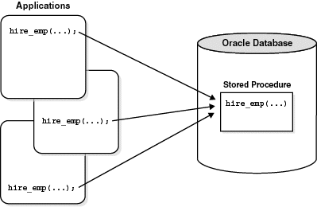

## 잠깐! 프로시저와 함수의 차이를 간략하게 알아보자.

### **프로시저** : 넓은 의미로는 어떤 업무를 수행하기 위한 절차

- 예를 들어, 계좌 송금이라면

- 1. 상대방 계좌를 입력하고

- 2. 내 계좌에 금액이 충분한지 확인하고

- 3. 내 계좌에서 돈이 빠지고

- 4. 상대방 계좌로 돈이 입금 되는 순서가 있다.

- 이처럼 프로세스를 절차적으로 기술이 된것을 프로시저라고 한다.

### **함수** :

- 프로시저의 각 프로세스를 수행하기 위해 필요한 기능들을 함수라고 한다.

- 내 계좌에 금액이 충분한지 체크 등 이런 기능들이 함수가 된다.

## 저장 프로시저 (Stored procedure)

- SP(저장 프로시저)는 일련의 쿼리를 마치 하나의 함수처럼 실행하기 위한 쿼리의 집합.

- 쉽게 말해, 특정 로직의 쿼리를 함수로 만들어 놓은 것!

- 자주 사용하는 쿼리를 함수로 한번 만들어 놓고 사용하게 되면 성능 상으로도, 코드 재사용성 등에 이점이 있다. 👍

## 프로시저 장점

1. 최적화 & 캐시

    - 프로시저의 최초 실행 시 최적화 상태로 컴파일이 되며, 그 이후 프로시저 캐시에 저장된다.

    - 만약 해당 프로세스가 여러번 사용될 때, 다시 컴파일 작업을 거치지 않고 캐시에서 가져오게 된다.

2. 유지 보수

    - 작업이 변경될 때, 다른 작업은 건드리지 않고 프로시저 내부에서 수정만 하면 된다.

3. 트래픽 감소

    - 클라이언트가 직접 SQL문을 작성하지 않고, 프로시저명에 매개변수만 담아 전달하면 된다.

    - 즉, SQL문이 서버에 이미 저장되어 있기 때문에 클라이언트와 서버 간 네트워크 상 트래픽이 감소된다.

4. 보안

    - 프로시저 내에서 참조 중인 테이블의 접근을 막을 수 있다.

## 프로시저 단점

1. 호환성

    - 구문 규칙이 SQL 표준과 호환성이 낮기 때문에 코드 자산으로의 재사용성이 나쁘다.

2. 성능

    - 문자 또는 숫자 연산에서 프로그래밍 언어인 C나 Java보다 성능이 느리다.

3. 디버깅

    - 에러가 발생했을 때, 어디서 잘못됐는지 디버깅하는 것이 힘들 수 있다.
