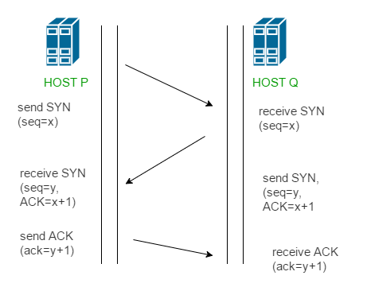

# TCP 3&4 handshake

### TCP 3-way Handshake란 ?

TCP / IP 프로토콜을 이용하는 프로그램이 **정확한 전송을 보장하기 위해 상대방 컴퓨터와 사전에 세션을 수립하는 과정**

=⇒ 클라이언트는 서버에 요청을 전송할 수 있는지, 서버는 클라이언트에게 응답을 전송할 수 있는지 확인하는 과정

### 단축어

```
- SYN : Synchronize Sqeunce Number
    - 연결 설정의 의미를 지닌다.
    - Sequence Number을 난수로 설정하여 세션을 연결하는데 사용하고, 초기의 Sequence Number인 ISN을 전송한다.
- ACK : Acknowledgement
    - 응답 확인의 의미를 지닌다. (패킷을 받았음을 의미한다.)
    - Acknowledgement Number 필드가 유효한지를 나타낸다.
- FIN : Finish
		- 연결 해제의 의미를 지닌다. (더 이상 전송할 데이터가 없다.)
		- 세션 연결을 종료시킬 때 사용된다.
```

## **3 way handshake - 연결 성립**

TCP는 정확한 전송을 보장해야 한다. 따라서 통신하기에 앞서, 논리적인 접속을 성립하기 위해 3 way handshake 과정을 진행한다.



1. **클라이언트는 서버에 접속을 요청하는 SYN(a) 패킷을 보낸다.**

```
Client ⇒ Server : SYN

Port 상태
Client : CLOSED
Server : LISTEN ⇒ SYN_RCV (클라이언트로부터 SYN을 받고 난 후)
```

1. **서버가 SYN(x)을 받고, 클라이언트로 받았다는 신호인 ACK와 SYN 패킷을 보냄 (sequence : y, ACK : x + 1)**

```
Server ⇒ Client : SYN + ACK

Port 상태
Client : CLOSED
Server : SYN_RCV
```

1. **클라이언트는 서버의 응답은 ACK(x+1)와 SYN(y) 패킷을 받고, ACK(y+1)를 서버로 보내면 연결이 성립된다.**

```
Client ⇒ Server : ACK

- 전송할 데이터가 있으면 이 단계에서 데이터를 전송할 수 있다.

Port 상태
Client : CLOSED => ESTABLISHED (서버로부터 ACK와 SYN을 받은뒤)
Server : SYN_RCV => ESTABLISHED (클라이언트로부터 ACK를 받은뒤) 
```

# ✅ 4 way handshake

## **4 way handshake - 연결 해제**


해제는 클라이언트, 서버 상관없이 먼저 할 수 있다.

**close를 먼저 요청한 쪽에 TIME_WAIT상태가 오래 지속된다.**

1. **클라이언트는 TCP 연결을 종료하겠다는 FIN 플래그를 전송한다.**
    - 서버가 FIN 플래그로 응ㄷ바하기 전까지 연결을 계속 유지한다.
    - Client ⇒ Server : FIN
    
2. **서버는 클라이언트의 요청(FIN)을 받고 확인을 알리는 ACK 패킷을 보낸다.**
    - 서버는 ACK Number 필드를 Sequence Number + 1로 설정하고 ACK 플래그 비트를 1로 설정한 세그먼트를 클라이언트에게 전송한다.
    - 그 후에 자신의 통신이 끝날 때까지 기다린다. (이 상태가 TIME_WAIT 상태이다)
        - 서버가 아직 전송할 데이터가 남아 있다면 이어서 전송한다.
        
3. **데이터를 모두 보내고 통신이 끝나면 서버는 연결이 종료되었다는 의미로 FIN 플래그를 클라이언트에게 전송한다.**

1. **클라이언트는 서버의 응답(FIN) 패킷을 확인했다는 의미로 ACK패킷을 보낸다.**
    - Client → Server : ACK

1. 서버는 클라이언트의 `ACK` 패킷을 받은 후 소켓 연결을 CLOSE 한다.

1. 클라이언트는 서버로부터 받지 못한 데이터가 있을 것을 대비하여 일정 시간 동안 세션을 남겨놓고 잉여 패킷을 기다리는 과정을 거친다. (TIME_WAIT)

### 두 종류의 패킷을 사용하는 이유

```python
연결을 성립하려면 서로 통신이 가능한 상태인지 확인하기 위해 패킷을 주고 받아야한다.
하지만 왜 두 종류의 패킷을 주고 받을까?
요청과 응답에 대한 패킷을 주고 받아야 하기 때문이다.
```

### 2way가 아닌 3way인 이유

1. 일단 클라이언트는 자신의 목소리가 들리는지 물어본다 👉 `SYN`
2. 서버는 클라이언트의 목소리가 들린다고 말한다 👉 `SYN + 1`그리고 서버 자신의 목소리가 들리는지 물어본다 👉 `ACK`
3. 클라이언트는 서버의 목소리가 들린다고 말한다 👉 `ACK + 1`총 3 번의 신호를 주고받아 TCP connection이 establish된다.

```python
TCP connection은 양방향성 connection이다.
클라이언트는 서버에게 자신의 존재를 알리고 패킷을 보낼 수 있다는 것을 알리듯
서버도 클라이언트에게 자신의 존재와 함께 패킷을 보낼 수 있다는 신호를 보내야한다.
그렇기 때문에 2 way handshake로는 부족하다.
```
